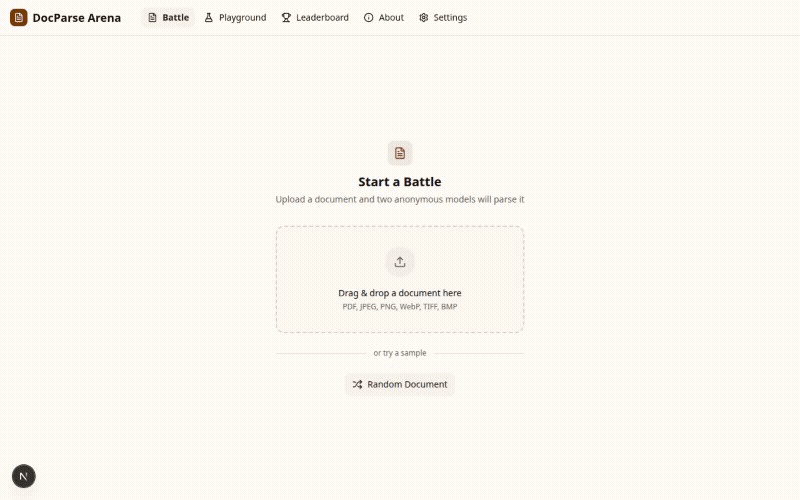

# DocParse Arena

[](https://opensource.org/licenses/MIT)
[](https://www.python.org/downloads/release/python-3130/)
[](https://nextjs.org/)
[](https://fastapi.tiangolo.com/)
[](https://www.docker.com/)
[](https://docs.anthropic.com/en/docs/claude-code)

[English](README.md) | **한국어**

어떤 문서 파싱 모델이든 — Claude, GPT, Gemini, 자체 호스팅 VLM — 내 문서로 직접 블라인드 비교하세요.
ELO 랭킹 기반 블라인드 배틀, 실시간 스트리밍, Docker 원클릭 배포.

> **AI로 개발** — 이 프로젝트의 90% 이상이 [Claude Code](https://docs.anthropic.com/en/docs/claude-code)를 사용하여 개발되었습니다.
> 아키텍처 설계부터 구현, 테스트, Docker 배포까지.

## 데모

<p align="center">
  
</p>

## 스크린샷

| 배틀 - 블라인드 비교 | 리더보드 |
|:---:|:---:|
|  |  |
| 두 익명 모델이 동일 문서를 파싱하며 실시간 토큰 스트리밍으로 결과 표시. 투표 시 모델 이름 공개 및 ELO 업데이트. | ELO 레이팅, 승률, 모델 간 상대 전적 통계. |

| 플레이그라운드 | 설정 |
|:---:|:---:|
|  |  |
| 개별 모델을 커스텀 프롬프트와 온도 조절로 테스트. | 프로바이더, 모델, 프롬프트, VLM 레지스트리 추천 관리. |

## 배경

[OCR Arena](https://www.ocrarena.ai)를 사용하여 상용 OCR 서비스를 비교하던 중,
자체 호스팅 VLM을 상용 모델과 비교하고 싶었습니다.

기존 플랫폼은 커스텀 모델 연결을 지원하지 않아서,
어떤 모델이든 연결하고 자체 데이터로 공정한 블라인드 평가를 수행할 수 있는
**셀프 호스팅 대안**으로 DocParse Arena를 만들었습니다.

## 주요 기능

- **블라인드 배틀** — 두 익명 모델이 동일 문서를 파싱. 투표로 정체를 공개하고 랭킹 업데이트.
- **실시간 토큰 스트리밍** — SSE를 통해 OCR 결과가 토큰 단위로 표시되며, Markdown/LaTeX 실시간 렌더링.
- **ELO 랭킹** — K-factor 20 레이팅 시스템과 모델 간 상대 전적 통계.
- **공정한 매치메이킹** — 가중 랜덤 선택으로 배틀 수가 적은 모델에 더 많은 기회 부여.
- **VLM 레지스트리** — 자체 호스팅 모델의 빌트인 프로필. 등록 시 추천 프롬프트와 후처리기 자동 적용.
- **멀티 프로바이더 지원** — Anthropic, OpenAI, Google Gemini, Mistral, Ollama 및 모든 OpenAI 호환 엔드포인트(vLLM, LiteLLM, LocalAI).
- **PDF 지원** — 자동 페이지 분할, 병렬 OCR 처리 및 결과 병합.
- **프롬프트 관리** — 글로벌 기본값 및 모델별 프롬프트 오버라이드.
- **플레이그라운드** — 개별 모델을 온도 조절과 커스텀 프롬프트로 테스트.
- **Docker 지원** — `docker compose up` 한 줄로 배포.
- **관리자 기능** — 프로바이더 연결 테스트, 모델 활성화/비활성화, 배틀 초기화, 팩토리 리셋.

## 빠른 시작

### Docker Compose (권장)

```bash
git clone https://github.com/Bae-ChangHyun/DocParse_Arena.git
cd DocParse_Arena
cp .env.example .env    # API 키와 ADMIN_PASSWORD 설정
docker compose up -d
```

http://localhost:3000 에 접속하여 배틀을 시작하세요.

### 수동 설치

**사전 요구사항:** Python 3.13+, Node.js 18+, [uv](https://docs.astral.sh/uv/), [pnpm](https://pnpm.io/)

```bash
git clone https://github.com/Bae-ChangHyun/DocParse_Arena.git
cd DocParse_Arena

# 백엔드
cd backend && uv sync && cp .env.example .env && uv run python seed_db.py && cd ..

# 프론트엔드
cd frontend && pnpm install && cd ..

# 실행 (또는 ./run.sh 사용)
cd backend && uv run uvicorn app.main:app --reload &
cd frontend && pnpm dev &
```

## 설정

### 환경 변수

`.env.example`을 `.env`로 복사하고 API 키를 입력합니다.
사용할 프로바이더의 키만 설정하면 됩니다.

### VLM 레지스트리

자체 호스팅 모델 추가 시 모델 ID가 알려진 패턴과 일치하면
추천 프롬프트와 후처리 파이프라인이 자동 제안됩니다.
수락하거나 커스터마이즈할 수 있습니다.

| 모델 | 출처 | 후처리기 | 비고 |
|------|------|----------|------|
| DeepSeek-OCR | [deepseek-ai](https://github.com/deepseek-ai/DeepSeek-VL2) | `deepseek_clean` | grounding 토큰 사용 |
| DeepSeek-OCR-2 | [deepseek-ai](https://github.com/deepseek-ai/DeepSeek-VL2) | `deepseek_clean` | Visual Causal Flow 아키텍처 |
| dots.ocr | [rednote-hilab](https://github.com/rednote-hilab/dots.ocr) | `dots_json_to_md` | 3B 모델, 구조화된 JSON 레이아웃 출력 |
| PaddleOCR-VL | [PaddlePaddle](https://github.com/PaddlePaddle/PaddleOCR) | — | 다중 태스크: OCR, Table, Formula, Chart |
| LightOnOCR-2-1B | [lightonai](https://huggingface.co/lightonai/lightonocr-2-1b) | `lighton_clean` | 1B 모델, H100에서 ~5.71 pages/sec |
| Nanonets-OCR | [nanonets](https://huggingface.co/nanonets/Nanonets-OCR-s) | — | HTML 테이블, LaTeX 수식, 시멘틱 태그 |
| GLM-OCR | [zai-org](https://huggingface.co/zai-org/GLM-OCR) | — | 직접 Markdown 출력 |

> 각 모델의 상세 사용법과 라이선스는 공식 레포지토리를 참조하세요.

### Extra Kwargs

**Settings > Models > Edit**에서 추가 API 파라미터를 JSON으로 전달:

```json
{ "max_completion_tokens": 4096, "temperature": 0.7 }
```

### 프롬프트 커스터마이즈

**Settings > Prompts**에서 글로벌 기본값과 모델별 오버라이드를 설정할 수 있습니다.

<details>
<summary><strong>API 엔드포인트</strong></summary>

| 메서드 | 엔드포인트 | 설명 |
|--------|----------|------|
| POST | `/api/battle/start` | 배틀 시작 (파일 업로드) |
| GET | `/api/battle/{id}/stream` | SSE로 OCR 결과 스트리밍 |
| POST | `/api/battle/{id}/vote` | 투표 및 ELO 업데이트 |
| GET | `/api/leaderboard` | 전체 랭킹 |
| GET | `/api/leaderboard/head-to-head` | 모델 간 상대 전적 |
| POST | `/api/playground/ocr` | 단일 모델 OCR 테스트 |
| GET/POST | `/api/admin/providers` | 프로바이더 관리 |
| GET/POST | `/api/admin/models` | 모델 관리 |
| GET/POST | `/api/admin/prompts` | 프롬프트 관리 |
| POST | `/api/admin/providers/{id}/test` | 연결 테스트 |

</details>

## 기여하기

기여를 환영합니다! 자세한 내용은 [CONTRIBUTING.md](CONTRIBUTING.md)를 참고하세요.

- **VLM 레지스트리에 모델 추가** — `backend/app/vlm_registry.py`에 추가해주세요.
- **새 프로바이더 추가** — `backend/app/ocr_providers/`에서 `OCRProviderBase` 인터페이스를 구현합니다.
- **UI 개선** — 프론트엔드는 `frontend/src/`에 shadcn/ui 컴포넌트로 구성되어 있습니다.
- **버그 리포트** — [이슈](https://github.com/Bae-ChangHyun/DocParse_Arena/issues)를 열어주세요.

## 보안

- `.env`에 강력한 `ADMIN_PASSWORD`를 설정하여 관리자 UI를 보호하세요.
- 공개 호스팅 시 `CORS_ORIGINS`를 설정하여 API 접근을 제한하세요.
- API 키는 데이터베이스에 저장됩니다 — `data/docparse_arena.db`를 안전하게 보호하고 절대 커밋하지 마세요.
- 업로드 파일은 경로 순회 방지, 크기 제한, PDF 페이지 상한으로 검증됩니다.

취약점 보고는 [SECURITY.md](SECURITY.md)를 참고하세요.

## 기술 스택

| 레이어 | 기술 |
|--------|------|
| 프론트엔드 | Next.js 15 (App Router), TypeScript, Tailwind CSS, shadcn/ui |
| 백엔드 | Python 3.13, FastAPI, SQLAlchemy (async), SQLite |
| 스트리밍 | SSE (Server-Sent Events), markstream-react |
| 렌더링 | react-markdown, remark-gfm, remark-math, rehype-katex, rehype-sanitize |
| 프로바이더 | Anthropic, OpenAI, Google Gemini, Mistral, Ollama, Custom (OpenAI 호환) |
| 배포 | Docker Compose, uv (Python), pnpm (Node.js) |

## 라이선스

[MIT License](LICENSE) — 자유롭게 사용, 수정, 배포할 수 있습니다.
