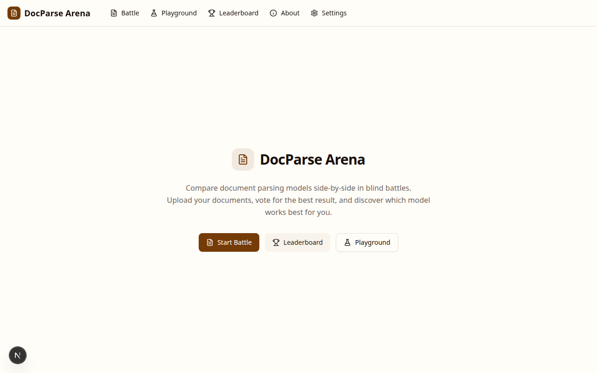
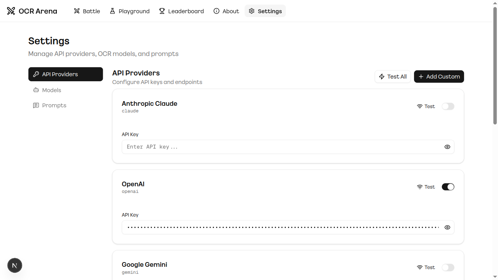

# DocParse Arena

[](https://opensource.org/licenses/MIT)
[](https://www.python.org/downloads/release/python-3130/)
[](https://nextjs.org/)
[](https://fastapi.tiangolo.com/)
[](https://www.docker.com/)

**English** | [한국어](README.ko.md)

A self-hosted, blind-test platform for evaluating document parsing (OCR/VLM) models with ELO rankings.

> **Built with AI** — Over 90% of this project was developed using [Claude Code](https://docs.anthropic.com/en/docs/claude-code), Anthropic's agentic coding tool. From architecture design to implementation, testing, and Docker deployment — Claude Code served as the primary development partner throughout the entire process.

Compare document parsing models side-by-side through blind battles, vote for the better result, and build your own private leaderboard. Supports commercial APIs (Claude, GPT, Gemini, Mistral) and self-hosted models (Ollama, vLLM, any OpenAI-compatible endpoint).

## Background

While using [OCR Arena](https://www.ocrarena.ai) to compare commercial OCR services, I wanted to go further — evaluating my own self-hosted VLMs (like DeepSeek-OCR, dots.ocr, PaddleOCR-VL) against commercial models on my private documents. Since existing platforms don't support custom model connections, I built DocParse Arena as a self-hosted alternative where you can plug in any model and run fair blind evaluations with your own data.

This project is inspired by the arena-style evaluation method of [LMSYS Chatbot Arena](https://lmsys.org/blog/2023-05-03-arena/), applied to the document parsing domain.

## Screenshots

| Battle - Blind Comparison | Leaderboard |
|:---:|:---:|
|  |  |
| Two anonymous models parse the same document with real-time token streaming. Vote to reveal model names and update ELO. | ELO ratings, win rates, and head-to-head matchup stats. |

| Playground | Settings |
|:---:|:---:|
|  |  |
| Test individual models with custom prompts and temperature control. | Manage providers, models, prompts, and VLM registry recommendations. |

## Key Features

- **Blind Battle** — Two anonymous models parse the same document. Vote to reveal identities and update rankings.
- **Real-time Token Streaming** — Watch OCR results appear token-by-token via SSE, rendered with Markdown/LaTeX in real time.
- **ELO Ranking** — K-factor 20 rating system with head-to-head matchup statistics.
- **Fair Matchmaking** — Weighted random selection (`weight = max_battles - model_battles + 1`) ensures underrepresented models get more battles.
- **VLM Registry** — Built-in profiles for self-hosted models (DeepSeek-OCR, dots.ocr, PaddleOCR-VL, Nanonets, etc.) with recommended prompts and post-processors auto-applied on registration.
- **Multi-Provider Support** — Anthropic, OpenAI, Google Gemini, Mistral, Ollama, and any OpenAI-compatible endpoint (vLLM, LiteLLM, LocalAI).
- **PDF Support** — Automatic page splitting with parallel OCR and result merging.
- **Prompt Management** — Global defaults and per-model prompt overrides.
- **Playground** — Test individual models with adjustable temperature and custom prompts.
- **Docker Ready** — One-command deployment with `docker compose up`.
- **Admin Controls** — Provider connection testing, model activation/deactivation, battle reset, and factory reset.

## Tech Stack

| Layer | Technology |
|-------|-----------|
| Frontend | Next.js 15 (App Router), TypeScript, Tailwind CSS, shadcn/ui |
| Backend | Python 3.13, FastAPI, SQLAlchemy (async), SQLite |
| Streaming | SSE (Server-Sent Events), markstream-react |
| Rendering | react-markdown, remark-gfm, remark-math, rehype-katex, rehype-sanitize |
| Providers | Anthropic, OpenAI, Google Gemini, Mistral, Ollama, Custom (OpenAI-compatible) |
| Deploy | Docker Compose, uv (Python), pnpm (Node.js) |

## Quick Start

### Docker Compose (Recommended)

The easiest way to get DocParse Arena running is using Docker Compose.

1. Clone the repository:
   ```bash
   git clone https://github.com/Bae-ChangHyun/DocParse_Arena.git
   cd DocParse_Arena
   ```
2. Set up your environment variables:
   ```bash
   cp .env.example .env
   # Edit .env with your API keys and ADMIN_PASSWORD
   ```
3. Start the services:
   ```bash
   docker compose up -d
   ```
4. Access the platform:
   - Frontend: http://localhost:3000
   - Backend API (manual setup only): http://localhost:8000/docs

### Manual Setup

#### Prerequisites
- Python 3.13+
- Node.js 18+
- [uv](https://docs.astral.sh/uv/) (Python package manager)
- [pnpm](https://pnpm.io/) (Node.js package manager)

#### 1. Installation
```bash
git clone https://github.com/Bae-ChangHyun/DocParse_Arena.git
cd DocParse_Arena

# Backend setup
cd backend
uv sync
cp .env.example .env
uv run python seed_db.py
cd ..

# Frontend setup
cd frontend
pnpm install
cd ..
```

#### 2. Configure API Keys
Edit `backend/.env` or configure them through the Settings UI after starting the application.

#### 3. Run the Application
```bash
# Using the launcher script
./run.sh

# Or start services individually
# Backend (Port 8000)
cd backend && uv run uvicorn app.main:app --reload
# Frontend (Port 3000)
cd frontend && pnpm dev
```

## Configuration

### Environment Variables
Copy `.env.example` to `.env` and fill in your API keys. You only need keys for the providers you want to use.

### VLM Registry
When adding a self-hosted model whose ID matches a known pattern (e.g., `deepseek-ocr`, `dots.ocr`, `paddleocr-vl`), the system automatically suggests recommended prompts and post-processing pipelines. These are opt-in — you can accept or customize them.

Currently registered models: DeepSeek-OCR, DeepSeek-OCR-2, dots.ocr, PaddleOCR-VL, LightOnOCR, Nanonets-OCR, GLM-OCR.

### Extra Kwargs
In **Settings > Models > Edit**, pass additional API parameters as JSON:

```json
{ "max_completion_tokens": 4096, "temperature": 0.7 }
```

### Prompt Customization
**Settings > Prompts** supports global defaults and per-model overrides.

## API Endpoints

| Method | Endpoint | Description |
|--------|----------|-------------|
| POST | `/api/battle/start` | Start a battle (file upload) |
| GET | `/api/battle/{id}/stream` | Stream OCR results via SSE |
| POST | `/api/battle/{id}/vote` | Submit vote and update ELO |
| GET | `/api/leaderboard` | Get global rankings |
| GET | `/api/leaderboard/head-to-head` | Get win rates between models |
| POST | `/api/playground/ocr` | Single model OCR test |
| GET/POST | `/api/admin/providers` | Manage providers |
| GET/POST | `/api/admin/models` | Manage models |
| GET/POST | `/api/admin/prompts` | Manage prompts |
| POST | `/api/admin/providers/{id}/test` | Connection test |

## Project Structure

```
docparse-arena/
├── backend/
│   ├── app/
│   │   ├── main.py              # FastAPI entry
│   │   ├── config.py            # Settings
│   │   ├── vlm_registry.py      # VLM model registry
│   │   ├── models/              # SQLAlchemy + Pydantic schemas
│   │   ├── routers/             # API endpoints
│   │   ├── services/            # Business logic (OCR, ELO, PDF, streaming)
│   │   └── ocr_providers/       # Provider implementations
│   ├── sample_docs/             # Sample documents
│   └── seed_db.py               # DB seeding
├── frontend/
│   ├── src/
│   │   ├── app/                 # Next.js pages (battle, leaderboard, playground, settings)
│   │   ├── components/          # React components
│   │   └── lib/                 # API client, utilities
│   └── package.json
├── docker-compose.yml           # One-command deployment
├── run.sh                       # Dev launcher script
└── .env.example                 # Environment template
```

## Contributing

Contributions are welcome! Here are some ways to get involved:

- **Add a VLM to the registry** — Know a model that works well for document parsing? Add it to `backend/app/vlm_registry.py`.
- **Add a new provider** — Implement the `OCRProviderBase` interface in `backend/app/ocr_providers/`.
- **Improve the UI** — Frontend lives in `frontend/src/` with shadcn/ui components.
- **Report bugs** — Open an [issue](https://github.com/Bae-ChangHyun/DocParse_Arena/issues).

### Development Workflow

```bash
# Fork & clone
git checkout -b feature/your-feature
# Make changes & test
git commit -m "feat: your feature description"
git push origin feature/your-feature
# Open a Pull Request
```

## Security

- Set a strong `ADMIN_PASSWORD` in `.env` to protect the admin UI.
- Configure `CORS_ORIGINS` to restrict API access when hosting publicly.
- API keys are stored in the database — keep `data/docparse_arena.db` secured and never commit it.
- Uploaded files are validated with path traversal guards, size limits, and PDF page caps.

## License

[MIT License](LICENSE) — free to use, modify, and distribute.
