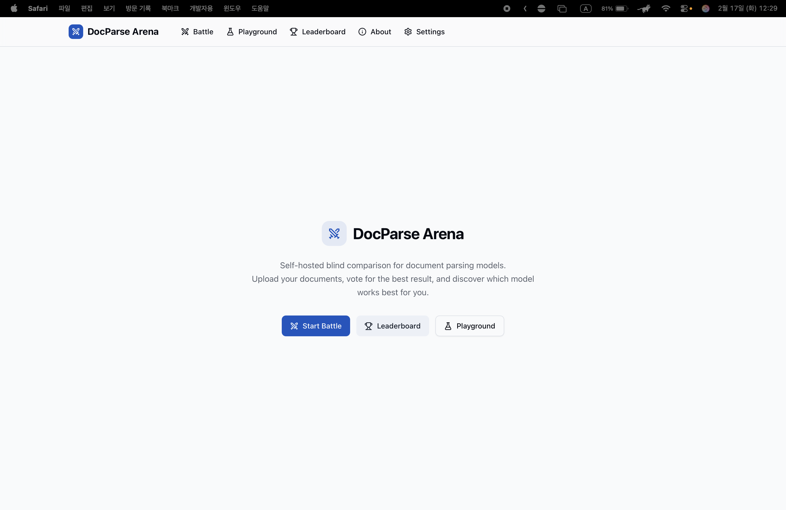
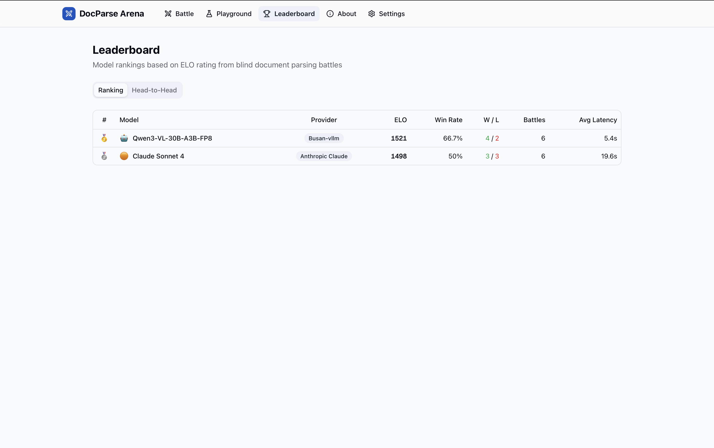
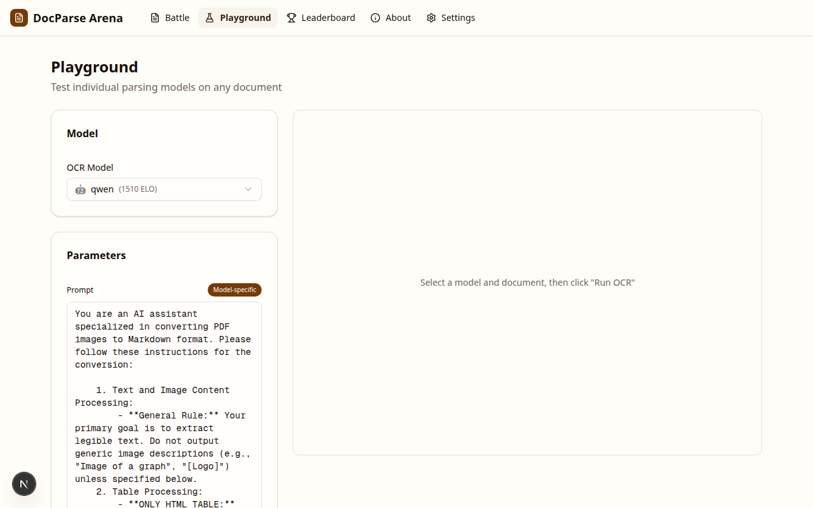
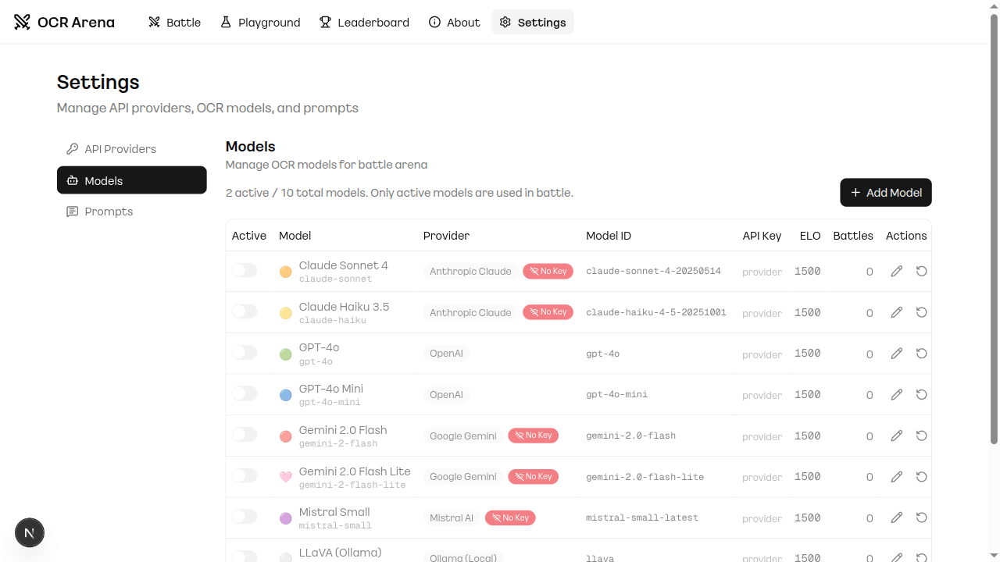

# DocParse Arena

[](https://opensource.org/licenses/MIT)
[](https://www.python.org/downloads/release/python-3130/)
[](https://nextjs.org/)
[](https://fastapi.tiangolo.com/)
[](https://www.docker.com/)
[](https://docs.anthropic.com/en/docs/claude-code)

**English** | [한국어](README.ko.md)

Compare ANY document parsing model — Claude, GPT, Gemini, or your self-hosted VLMs — side-by-side on your own private documents.
ELO-ranked blind battles, real-time streaming, Docker one-click deploy.

> **Built with AI** — Over 90% of this project was developed using [Claude Code](https://docs.anthropic.com/en/docs/claude-code).
> From architecture design to implementation, testing, and Docker deployment.

## Demo

<p align="center">
  <a href="docs/demo.mp4">
    
  </a>
</p>
<p align="center"><em>Click the image to watch the demo video</em></p>

## Screenshots

| Home | Leaderboard |
|:---:|:---:|
|  |  |
| Self-hosted blind comparison platform with blue accent theme. | ELO ratings, win rates, and head-to-head matchup stats. |

| Playground | Settings - Models |
|:---:|:---:|
|  |  |
| Test individual models with custom prompts and temperature control. | Manage providers, models, prompts, and VLM registry recommendations. |

## Background

While using [OCR Arena](https://www.ocrarena.ai) to compare commercial OCR services,
I wanted to go further — evaluating my own self-hosted VLMs against commercial models on my private documents.

Since existing platforms don't support custom model connections,
I built DocParse Arena as a **self-hosted alternative** where you can plug in any model
and run fair blind evaluations with your own data.

## Key Features

- **Blind Battle** — Two anonymous models parse the same document. Vote to reveal identities and update rankings.
- **Real-time Token Streaming** — OCR results appear token-by-token via SSE, rendered with Markdown/LaTeX in real time.
- **ELO Ranking** — K-factor 20 rating system with head-to-head matchup statistics.
- **Fair Matchmaking** — Weighted random selection ensures underrepresented models get more battles.
- **VLM Registry** — Built-in profiles for self-hosted models with recommended prompts and post-processors auto-applied on registration.
- **Multi-Provider Support** — Anthropic, OpenAI, Google Gemini, Mistral, Ollama, and any OpenAI-compatible endpoint (vLLM, LiteLLM, LocalAI).
- **PDF Support** — Automatic page splitting with parallel OCR and result merging.
- **Prompt Management** — Global defaults and per-model prompt overrides.
- **Playground** — Test individual models with adjustable temperature and custom prompts.
- **Docker Ready** — One-command deployment with `docker compose up`.
- **Admin Controls** — Provider connection testing, model activation/deactivation, battle reset, and factory reset.

## Quick Start

### Docker Compose (Recommended)

```bash
git clone https://github.com/Bae-ChangHyun/DocParse_Arena.git
cd DocParse_Arena
cp .env.example .env    # Edit with your API keys and ADMIN_PASSWORD
docker compose up -d
```

Open http://localhost:3000 and start battling.

### Manual Setup

**Prerequisites:** Python 3.13+, Node.js 18+, [uv](https://docs.astral.sh/uv/), [pnpm](https://pnpm.io/)

```bash
git clone https://github.com/Bae-ChangHyun/DocParse_Arena.git
cd DocParse_Arena

# Backend
cd backend && uv sync && cp .env.example .env && uv run python seed_db.py && cd ..

# Frontend
cd frontend && pnpm install && cd ..

# Run (or use ./run.sh)
cd backend && uv run uvicorn app.main:app --reload &
cd frontend && pnpm dev &
```

## Configuration

### Environment Variables

Copy `.env.example` to `.env` and fill in your API keys.
You only need keys for the providers you want to use.

### VLM Registry

When adding a self-hosted model whose ID matches a known pattern,
the system automatically suggests recommended prompts and post-processing pipelines.
These are opt-in — you can accept or customize them.

| Model | Source | Post-processor | Notes |
|-------|--------|----------------|-------|
| DeepSeek-OCR | [deepseek-ai](https://github.com/deepseek-ai/DeepSeek-VL2) | `deepseek_clean` | Uses grounding token in prompt |
| DeepSeek-OCR-2 | [deepseek-ai](https://github.com/deepseek-ai/DeepSeek-VL2) | `deepseek_clean` | Visual Causal Flow architecture |
| dots.ocr | [rednote-hilab](https://github.com/rednote-hilab/dots.ocr) | `dots_json_to_md` | 3B model, structured JSON layout output |
| PaddleOCR-VL | [PaddlePaddle](https://github.com/PaddlePaddle/PaddleOCR) | — | Multi-task: OCR, Table, Formula, Chart |
| LightOnOCR-2-1B | [lightonai](https://huggingface.co/lightonai/lightonocr-2-1b) | `lighton_clean` | 1B model, ~5.71 pages/sec on H100 |
| Nanonets-OCR | [nanonets](https://huggingface.co/nanonets/Nanonets-OCR-s) | — | HTML tables, LaTeX equations, semantic tags |

> Refer to each model's official repository for detailed usage and licensing information.

### Prompt & Model Settings

- **Settings > Prompts** — Global defaults and per-model prompt overrides.
- **Settings > Models > Edit** — Pass additional API parameters as JSON (e.g., `{"max_completion_tokens": 4096}`).

<details>
<summary><strong>API Reference</strong></summary>

| Method | Endpoint | Description |
|--------|----------|-------------|
| POST | `/api/battle/start` | Start a battle (file upload) |
| GET | `/api/battle/{id}/stream` | Stream OCR results via SSE |
| POST | `/api/battle/{id}/vote` | Submit vote and update ELO |
| GET | `/api/leaderboard` | Get global rankings |
| GET | `/api/leaderboard/head-to-head` | Get win rates between models |
| POST | `/api/playground/ocr` | Single model OCR test |
| GET/POST | `/api/admin/providers` | Manage providers |
| GET/POST | `/api/admin/models` | Manage models |
| GET/POST | `/api/admin/prompts` | Manage prompts |
| POST | `/api/admin/providers/{id}/test` | Connection test |

</details>

## Contributing

Contributions are welcome! See [CONTRIBUTING.md](CONTRIBUTING.md) for details.

- **Add a VLM to the registry** — Add it to `backend/app/vlm_registry.py`.
- **Add a new provider** — Implement the `OCRProviderBase` interface in `backend/app/ocr_providers/`.
- **Improve the UI** — Frontend lives in `frontend/src/` with shadcn/ui components.
- **Report bugs** — Open an [issue](https://github.com/Bae-ChangHyun/DocParse_Arena/issues).

## Security

- Set a strong `ADMIN_PASSWORD` in `.env` to protect the admin UI.
- Configure `CORS_ORIGINS` to restrict API access when hosting publicly.
- API keys are stored in the database — keep `data/docparse_arena.db` secured and never commit it.
- Uploaded files are validated with path traversal guards, size limits, and PDF page caps.

See [SECURITY.md](SECURITY.md) for vulnerability reporting.

## Tech Stack

| Layer | Technology |
|-------|-----------|
| Frontend | Next.js 15 (App Router), TypeScript, Tailwind CSS, shadcn/ui |
| Backend | Python 3.13, FastAPI, SQLAlchemy (async), SQLite |
| Streaming | SSE (Server-Sent Events), markstream-react |
| Rendering | react-markdown, remark-gfm, remark-math, rehype-katex, rehype-sanitize |
| Providers | Anthropic, OpenAI, Google Gemini, Mistral, Ollama, Custom (OpenAI-compatible) |
| Deploy | Docker Compose, uv (Python), pnpm (Node.js) |

## License

[MIT License](LICENSE) — free to use, modify, and distribute.
