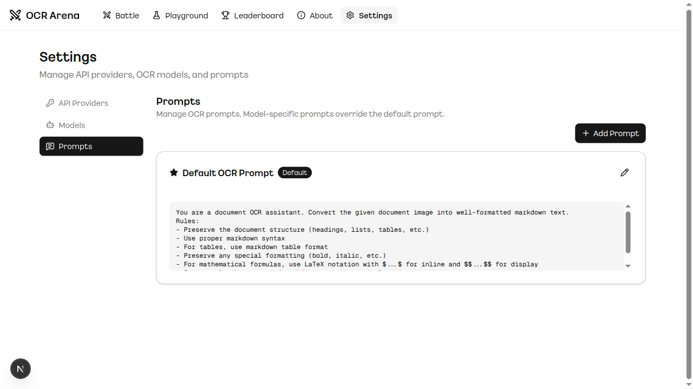

# OCR Arena

OCR 모델 블라인드 테스트 & ELO 랭킹 플랫폼.

여러 OCR 모델(Claude, GPT, Gemini, Mistral, Ollama, Custom)을 동일한 문서에 대해 블라인드로 비교하고, 투표를 통해 ELO 랭킹을 산출합니다. 자체 API 키와 모델을 연결하여 나만의 OCR 리더보드를 운영할 수 있습니다.

## Background

이 프로젝트는 [ocrarena.ai](https://www.ocrarena.ai)에서 영감을 받아 제작된 self-hosted 버전입니다. 자체 OCR 모델을 연결하고, 자신만의 private 데이터셋으로 블라인드 테스트와 ELO 랭킹을 통해 모델 성능을 평가할 수 있습니다.

## Screenshots

### Battle - 블라인드 OCR 비교
문서를 업로드하면 2개의 익명 모델이 동시에 OCR을 수행합니다. 결과를 비교한 뒤 투표하면 모델명이 공개되고 ELO가 업데이트됩니다.


### Leaderboard - ELO 랭킹
모델별 ELO, 승률, 평균 지연시간 등을 확인할 수 있습니다.


### Playground - 단일 모델 테스트
특정 모델을 선택하여 개별적으로 OCR 결과를 확인합니다.


### Settings - 프로바이더 관리
API 키, Base URL 설정 및 연결 테스트. 커스텀 프로바이더(vLLM, LiteLLM 등)를 여러 개 추가할 수 있습니다.


### Settings - 모델 관리
모델 추가/삭제, 활성화 토글, ELO 초기화 등.


### Settings - 프롬프트 관리
기본 프롬프트와 모델별 프롬프트를 설정합니다. 모델별 프롬프트가 있으면 우선 적용됩니다.



## Features

- **블라인드 배틀**: 2개 모델의 OCR 결과를 익명으로 비교 후 투표
- **ELO 랭킹**: K-factor 20 기반 ELO 레이팅 시스템
- **Fair 매칭 시스템**: 배틀 횟수가 적은 모델에 더 높은 선택 확률 부여 (`weight = max_battles - model_battles + 1`)로 모든 모델이 균등한 평가 기회 확보
- **다중 프로바이더**: Claude, OpenAI, Gemini, Mistral, Ollama + 커스텀(OpenAI-compatible)
- **PDF 지원**: PDF를 페이지별 이미지로 분할 후 병렬 OCR, 결과 자동 병합
- **마크다운 렌더링**: Markdown + HTML + LaTeX(KaTeX) 렌더링
- **프롬프트 관리**: 기본 프롬프트 + 모델별 프롬프트 오버라이드
- **실시간 연결 테스트**: 프로바이더 연결 상태를 실제 API 호출(e.g., `GET /v1/models`)로 확인, 문자열 검증이 아닌 실제 통신 테스트
- **커스텀 프로바이더**: vLLM, LiteLLM, LocalAI 등 OpenAI-compatible 엔드포인트 여러 개 등록 가능
- **유연한 API 파라미터 설정**: 모델별 Extra Kwargs를 JSON으로 설정 가능 (OpenAI o1/o3 등 `max_completion_tokens` 지원)

## Tech Stack

| Component | Technology |
|-----------|-----------|
| Frontend | Next.js 15 (App Router), TypeScript, Tailwind CSS, shadcn/ui |
| Backend | Python 3.13, FastAPI, SQLAlchemy (async), SQLite |
| OCR Providers | Anthropic, OpenAI, Google GenAI, Mistral, Ollama, Custom |
| Rendering | react-markdown, remark-gfm, remark-math, rehype-katex, rehype-raw |
| Package Managers | uv (Python), pnpm (Node.js) |

## Quick Start

### Prerequisites

- Python 3.13+
- Node.js 18+
- [uv](https://docs.astral.sh/uv/) (Python package manager)
- [pnpm](https://pnpm.io/) (Node.js package manager)

### 1. Clone & Install

```bash
git clone https://github.com/Bae-ChangHyun/OCR_Arena.git
cd OCR_Arena

# Backend
cd backend
uv sync
cp .env.example .env  # API 키 설정
uv run python seed_db.py
cd ..

# Frontend
cd frontend
pnpm install
cd ..
```

### 2. Configure API Keys

`backend/.env` 파일에 사용할 API 키를 설정하거나, 실행 후 Settings 페이지에서 설정할 수 있습니다.

```env
ANTHROPIC_API_KEY=sk-ant-...
OPENAI_API_KEY=sk-...
GOOGLE_API_KEY=AI...
MISTRAL_API_KEY=...
```

### 3. Run

```bash
# 동시 실행 (기본: backend=8000, frontend=3000)
./run.sh

# 포트 지정
./run.sh --backend-port 9000 --frontend-port 4000

# 또는 개별 실행
cd backend && uv run uvicorn app.main:app --reload --port 8000
cd frontend && pnpm dev --port 3000
```

### 4. Access

- Frontend: http://localhost:3000
- Backend API: http://localhost:8000/docs (Swagger UI)

## Configuration

### Model-Specific API Parameters (Extra Kwargs)

각 모델의 **Settings > Models > Edit** 다이얼로그에서 `Extra Kwargs`를 JSON 형식으로 설정할 수 있습니다.

```json
{
  "max_completion_tokens": 4096,
  "temperature": 0.7
}
```

**중요**: 기본 파라미터는 설정되지 않으며, Extra Kwargs에 입력된 값만 API에 전달됩니다. 단, Claude 모델은 예외적으로 `max_tokens=4096`이 강제 적용됩니다.

**사용 예시**:
- OpenAI의 최신 모델(`o1`, `o3` 등)은 `max_tokens` 대신 `max_completion_tokens`를 사용해야 합니다.
- 모델별로 `temperature`, `top_p` 등의 파라미터를 개별 설정할 수 있습니다.

### Prompt Customization

**Settings > Prompts**에서 기본 프롬프트와 모델별 프롬프트를 설정할 수 있습니다.

- **Default Prompt**: 모든 모델에 공통 적용
- **Model-Specific Prompt**: 특정 모델에만 적용 (기본 프롬프트를 오버라이드)

모델별 프롬프트가 설정되어 있으면 해당 모델은 기본 프롬프트 대신 모델별 프롬프트를 사용합니다.

### Fair Matchmaking (Weighted Random Selection)

배틀에서 모델 선택 시, 단순 랜덤이 아닌 **가중치 기반 랜덤 선택**을 사용합니다.

**알고리즘**:
```
weight = max_battles - model_battles + 1
```

배틀 횟수가 적은 모델일수록 선택 확률이 높아져, 모든 모델이 공평한 평가 기회를 얻습니다.

**예시**:
- Model A: 100 battles → weight = 1
- Model B: 50 battles → weight = 51
- Model C: 10 battles → weight = 91

→ Model C가 선택될 확률이 가장 높음

### Provider Connection Testing

**Settings > Providers**의 "Test Connection" 및 "Test All" 기능은 실제 API 호출을 수행합니다.

- API 키 문자열 검증이 아닌, 실제 `GET /v1/models` 등의 엔드포인트를 호출하여 연결 상태를 확인
- 테스트 실패 시 해당 프로바이더의 모든 모델이 자동으로 비활성화됨

## Project Structure

```
OCR_Arena/
├── backend/
│   ├── app/
│   │   ├── main.py              # FastAPI entry
│   │   ├── config.py            # Settings
│   │   ├── models/
│   │   │   ├── database.py      # SQLAlchemy models
│   │   │   └── schemas.py       # Pydantic schemas
│   │   ├── routers/
│   │   │   ├── battle.py        # Battle API (start/stream/vote)
│   │   │   ├── leaderboard.py   # Ranking API
│   │   │   ├── playground.py    # Single model OCR
│   │   │   ├── documents.py     # Document management
│   │   │   └── admin.py         # Settings API
│   │   ├── services/
│   │   │   ├── ocr_service.py   # OCR orchestration
│   │   │   ├── elo_service.py   # ELO calculation
│   │   │   ├── pdf_service.py   # PDF to images
│   │   │   └── diff_service.py  # Text diff
│   │   └── ocr_providers/       # Provider implementations
│   ├── sample_docs/             # Sample documents
│   ├── seed_db.py               # DB seeding
│   └── pyproject.toml
├── frontend/
│   ├── src/
│   │   ├── app/                 # Next.js pages
│   │   ├── components/          # React components
│   │   └── lib/api.ts           # API client
│   └── package.json
├── run.sh                       # Launcher script
└── README.md
```

## API Endpoints

| Method | Endpoint | Description |
|--------|----------|-------------|
| POST | `/api/battle/start` | 배틀 시작 (파일 업로드) |
| GET | `/api/battle/{id}/stream` | SSE로 OCR 결과 스트리밍 |
| POST | `/api/battle/{id}/vote` | 투표 + ELO 업데이트 |
| GET | `/api/leaderboard` | 전체 랭킹 |
| GET | `/api/leaderboard/head-to-head` | 모델간 승률 |
| POST | `/api/playground/ocr` | 단일 모델 OCR |
| GET/POST | `/api/admin/providers` | 프로바이더 관리 |
| GET/POST | `/api/admin/models` | 모델 관리 |
| GET/POST | `/api/admin/prompts` | 프롬프트 관리 |
| POST | `/api/admin/providers/{id}/test` | 연결 테스트 |

## License

MIT
